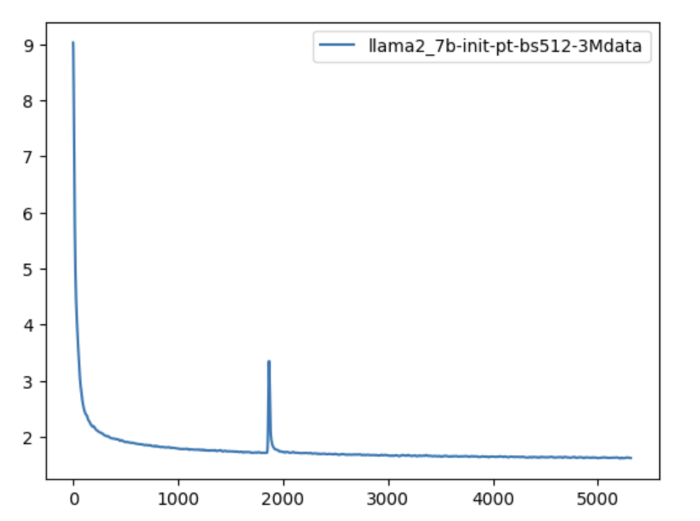
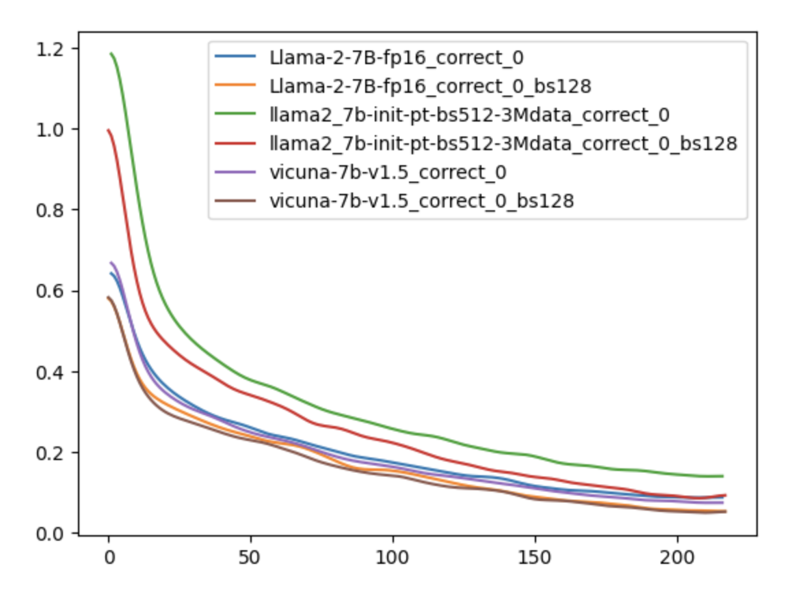
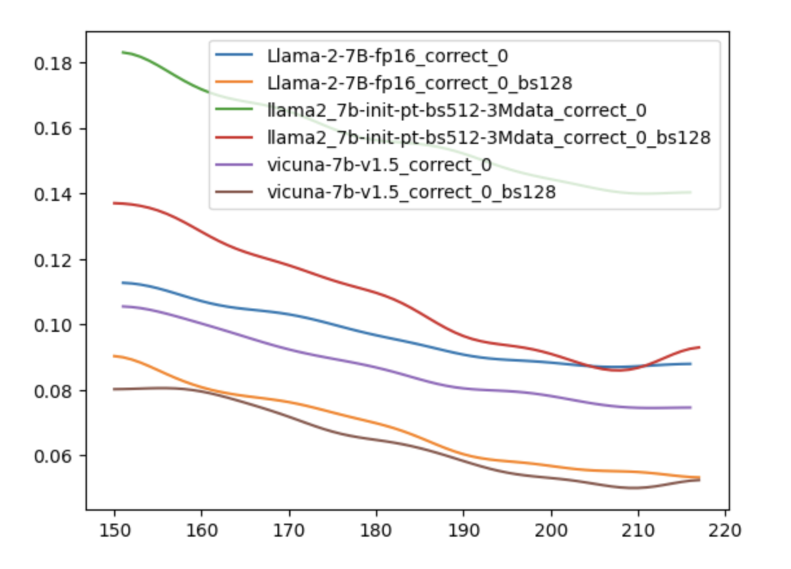
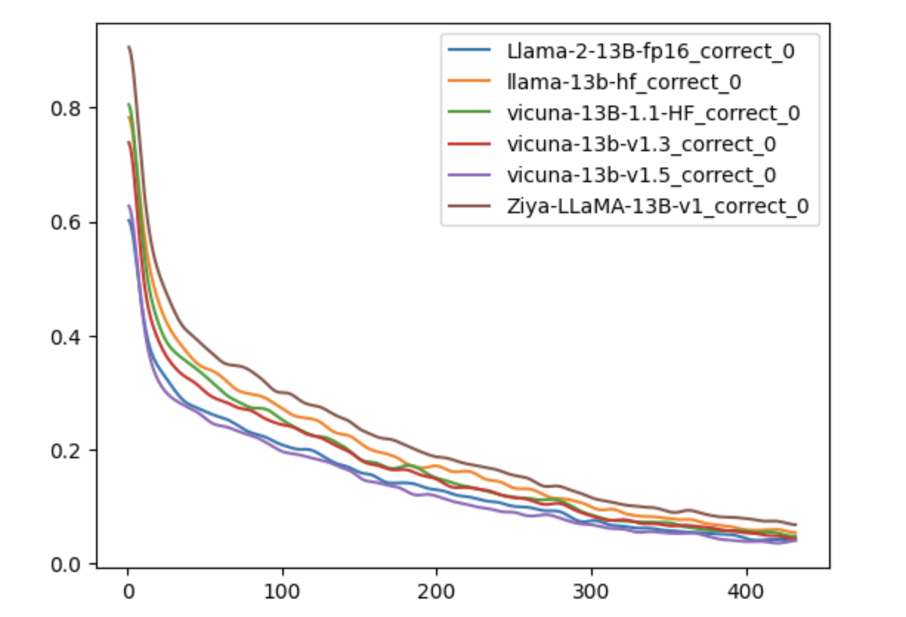
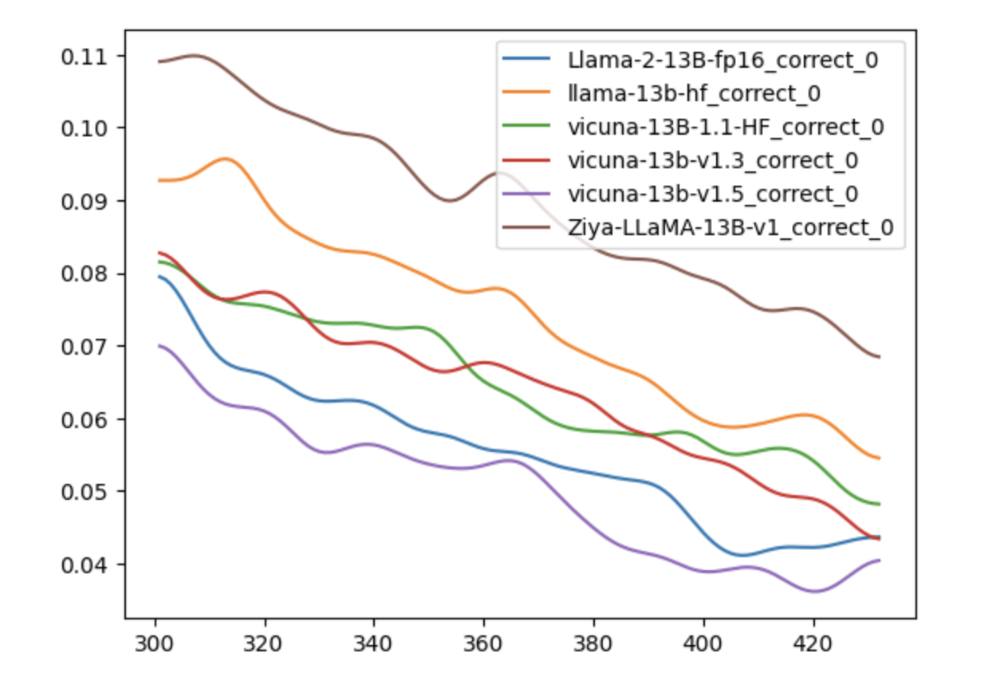
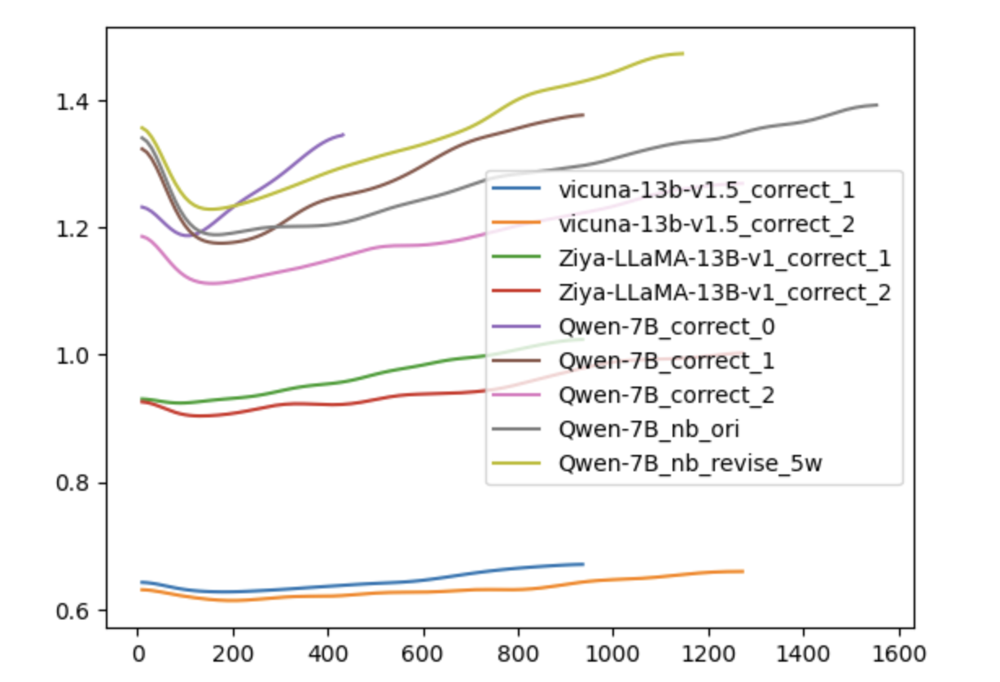

# 实验记录

## Qwen

- qwen， A10 qps 0.28，A100 qps 0.34q。
  - 如果不使用kv_cache，A10 qps=0.05，差5倍左右。

- pv统计：
  - top4，阈值>=2，单天45383788 loc，pv占比92%，loc数占比48%
  -  top10，阈值>=5，单天59122378 loc，pv占比91%，loc数占比27%
- 


| 原始参数       | batch size | epoch | lr   | rougeL | time precision | time recall |
| -------------- | ---------- | ----- | ---- | ------ | -------------- | ----------- |
| output_13b_60k |            | 3     |      | 0.277  | 0.4619         |             |


## 解码策略影响

单条数据，通过generate，调用10次，得到的结果，时间取均值。

| 策略          | 参数              | 是否唯一 | 备注       | 时间1 | 时间2 | 时间3 |
| ------------- | ----------------- | -------- | ---------- | ----- | ----- | ----- |
| Top k sample  | temperature=0.7   | 否       |            | 2.69s | 2.13s | 2.18s |
| Top k sample  | temperature=0.001 | 是       |            | 2.49s | 1.84s | 1.92s |
| Greedy search |                   | 是       |            | 2.36s | 1.81s | 1.89s |
| Beam search   | num_beams=2       | 是       | 时间点变准 | 2.38s | 2.08s | 2.61s |
| Beam search   | num_beams=5       | 是       |            | 2.97s | 2.97s | 2.78s |
| Beam search   | num_beams=10      | 是       | 时间点变准 | 3.49s | 3.84s | 3.28s |
| Beam search   | num_beams=50      | 是       | 时间点变准 | 10s   | 13.7s | 9.5s  |

整个测试集结果

| 策略          | 参数              | 是否唯一 | 备注 | 平均速度1      | 平均速度2      |
| ------------- | ----------------- | -------- | ---- | -------------- | -------------- |
| Top k sample  | temperature=0.7   | 否       |      | 555/194=2.86s  | 700/189=3.7s   |
| Top k sample  | temperature=0.001 | 是       |      | 659/192=3.43s  | 585/192=3.04s  |
| Greedy search |                   | 是       |      | 578/192=3.01s  | 606/192=3.15s  |
| Beam search   | num_beams=2       | 是       |      | 747/184=4.05s  | 796/184=4.32s  |
| Beam search   | num_beams=5       | 是       |      | 1070/183=5.85s | 1075/183=5.87s |


## 训练数据

| 名称                    | 数据量级 | 备注 |
| ----------------------- | -------- | ---- |
| correct_0_filter        | 18455    |      |
| correct_1_filter        | 39993    |      |
| correct_2_filter        | 54257    |      |
| nb                      | 66320    |      |
| nb_time_reward_revise   | 48879    |      |
| gpt4                    | 31839    |      |
| gpt4_time_reward_revise | 19710    |      |
|                         |          |      |
| ct                      | 2720676  |      |


## 7B预训练3B tokens的loss曲线 




## 7B model，不同batch size 的影响

```python
# eval loss
{
  'output_Llama-2-7B-fp16_correct_0_bs256': [0.7905235886573792], 
  'output_Llama-2-7B-fp16_correct_0_bs128': [0.7610925436019897], 
   # 'output_Llama-2-7B-fp16-init_correct_0_bs256': [1.7455271482467651], 
   # 'output_Llama-2-7B-fp16-init_correct_0_bs128': [1.6066316366195679], 
  'output_llama2_7b-init-pt-bs512-3Mdata_correct_0_bs256': [1.0895754098892212],
  'output_llama2_7b-init-pt-bs512-3Mdata_correct_0_bs128': [1.1433683633804321],
  'output_vicuna-7b-v1.5_correct_0_bs256': [0.8227277994155884], 
  'output_vicuna-7b-v1.5_correct_0_bs128': [0.7545920610427856]
}
```

对不同的小batch size的步骤，进行了下采样，使得总的steps数是一样的





## 13B model，不同model的影响

```python
# eval loss
{'output_Llama-2-13B-fp16_correct_0': [0.7084029316902161],
 'output_llama-13b-hf_correct_0': [0.8345360159873962],
 'output_vicuna-13B-1.1-HF_correct_0': [0.790613055229187],
 'output_vicuna-13b-v1.3_correct_0': [0.7770754098892212],
 'output_vicuna-13b-v1.5_correct_0': [0.6829675436019897],
 'output_Ziya-LLaMA-13B-v1_correct_0': [1.0715649127960205]}
```




放大之后




## 数据记录：

```python

Inference time: 80.19823002815247 | QPS: 3.591101697617287 | Throughput: 267.33757082262025
llama-13b-hf_correct_0
{'rougeL': 0.3112249297827291, 'time_precision': 0.4873417721518987, 'time_recall': 0.2950191570881226, 'loose_precision': 0.5421940928270043, 'loose_recall': 0.3282247765006386}


Inference time: 88.34909129142761 | QPS: 3.259795837061928 | Throughput: 316.2794273438245
Llama-2-13B-fp16_correct_0
{'rougeL': 0.415314384726413, 'time_precision': 0.4914330218068536, 'time_recall': 0.40293742017879947, 'loose_precision': 0.5521806853582555, 'loose_recall': 0.45274584929757344}


Inference time: 60.72792935371399 | QPS: 4.742463691171228 | Throughput: 292.8471329298233
Llama-2-13B-fp16-init_correct_0
{'rougeL': 0.370002800531491, 'time_precision': 0.44795221843003413, 'time_recall': 0.33524904214559387, 'loose_precision': 0.5102389078498294, 'loose_recall': 0.3818646232439336}


Inference time: 86.16572141647339 | QPS: 3.3423964340527115 | Throughput: 316.80811755823237
vicuna-13B-1.1-HF_correct_0
{'rougeL': 0.42161801078680206, 'time_precision': 0.48712288447387786, 'time_recall': 0.4227330779054917, 'loose_precision': 0.543046357615894, 'loose_recall': 0.47126436781609193}


Inference time: 90.65906691551208 | QPS: 3.176736864812384 | Throughput: 316.6699258746484
vicuna-13b-v1.3_correct_0
{'rougeL': 0.41701290759009946, 'time_precision': 0.46599131693198265, 'time_recall': 0.4112388250319285, 'loose_precision': 0.5209840810419681, 'loose_recall': 0.45977011494252873}


Inference time: 85.2108166217804 | QPS: 3.379852598741384 | Throughput: 309.5499027673663
vicuna-13b-v1.5_correct_0
{'rougeL': 0.4322898770152904, 'time_precision': 0.4791356184798808, 'time_recall': 0.4106002554278416, 'loose_precision': 0.5402384500745157, 'loose_recall': 0.46296296296296297}


Inference time: 85.57056260108948 | QPS: 3.3656434087338023 | Throughput: 318.9297717630354
vicuna-13b-v1.5_correct_1
{'rougeL': 0.44733673106120314, 'time_precision': 0.5050505050505051, 'time_recall': 0.44699872286079184, 'loose_precision': 0.5656565656565656, 'loose_recall': 0.5006385696040868}


Inference time: 84.80010056495667 | QPS: 3.396222387488712 | Throughput: 316.9453788490768
vicuna-13b-v1.5_correct_2
{'rougeL': 0.44322401470210926, 'time_precision': 0.49859154929577465, 'time_recall': 0.4521072796934866, 'loose_precision': 0.5521126760563381, 'loose_recall': 0.5006385696040868}


Inference time: 99.37958002090454 | QPS: 2.8979796447058748 | Throughput: 333.61984416744195
vicuna-13b-v1.5_gpt4_ori
{'rougeL': 0.424043123682426, 'time_precision': 0.5115303983228512, 'time_recall': 0.4674329501915709, 'loose_precision': 0.5604472396925227, 'loose_recall': 0.51213282247765}


Inference time: 112.48874878883362 | QPS: 2.5602560531688376 | Throughput: 302.82139651091416
vicuna-13b-v1.5_gpt4_revise_2w
{'rougeL': 0.4062697516298002, 'time_precision': 0.46191474493361284, 'time_recall': 0.4220945083014049, 'loose_precision': 0.522711390635919, 'loose_recall': 0.4776500638569604}


Inference time: 89.57371473312378 | QPS: 3.215228941415103 | Throughput: 320.1050674902613
vicuna-13b-v1.5_nb_ori
{'rougeL': 0.42271760881671794, 'time_precision': 0.4704244954766875, 'time_recall': 0.43167305236270753, 'loose_precision': 0.5191370911621433, 'loose_recall': 0.4763729246487867}

Inference time: 86.70989966392517 | QPS: 3.321420058335273 | Throughput: 298.5587585770262
vicuna-13b-v1.1_nb_ori
{'rougeL': 0.40371702182050007, 'time_precision': 0.4606918238993711, 'time_recall': 0.37420178799489145, 'loose_precision': 0.5212264150943396, 'loose_recall': 0.42337164750957856}

Inference time: 86.18225502967834 | QPS: 3.3417552128430876 | Throughput: 323.639709710484
vicuna-13b-v1.5_nb_revise_5w
{'rougeL': 0.4452713143503207, 'time_precision': 0.4963872832369942, 'time_recall': 0.4386973180076628, 'loose_precision': 0.5534682080924855, 'loose_recall': 0.4891443167305236}


Inference time: 64.87611699104309 | QPS: 4.43922992554813 | Throughput: 297.76751285325963
Ziya-LLaMA-13B-v1_correct_0
{'rougeL': 0.4615625941526087, 'time_precision': 0.49826026443980515, 'time_recall': 0.45721583652618136, 'loose_precision': 0.5560194850382741, 'loose_recall': 0.5102171136653896}


Inference time: 63.037776470184326 | QPS: 4.568689064345703 | Throughput: 298.96359064812196
Ziya-LLaMA-13B-v1_correct_1
{'rougeL': 0.44960444878296124, 'time_precision': 0.4860335195530726, 'time_recall': 0.4444444444444444, 'loose_precision': 0.5412011173184358, 'loose_recall': 0.4948914431673052}


Inference time: 62.12243366241455 | QPS: 4.636006399315396 | Throughput: 306.8134790658036
Ziya-LLaMA-13B-v1_correct_2
{'rougeL': 0.445174797671651, 'time_precision': 0.4713687150837989, 'time_recall': 0.43103448275862066, 'loose_precision': 0.5244413407821229, 'loose_recall': 0.47956577266922096}


Inference time: 82.84777665138245 | QPS: 3.476255026274073 | Throughput: 281.3714615190101
Ziya-LLaMA-13B-v1_gpt4_ori
{'rougeL': 0.41520484729803825, 'time_precision': 0.47357992073976224, 'time_recall': 0.4578544061302682, 'loose_precision': 0.523117569352708, 'loose_recall': 0.5057471264367817}


Inference time: 66.63829135894775 | QPS: 4.321839502887093 | Throughput: 320.6564808947618
Ziya-LLaMA-13B-v1_gpt4_revise_2w
{'rougeL': 0.4278599685448066, 'time_precision': 0.4725651577503429, 'time_recall': 0.4399744572158365, 'loose_precision': 0.5315500685871056, 'loose_recall': 0.4948914431673052}


Inference time: 58.03870606422424 | QPS: 4.962205733554882 | Throughput: 299.2658034240095
Ziya-LLaMA-13B-v1_nb_ori
{'rougeL': 0.41311196398362654, 'time_precision': 0.4570552147239264, 'time_recall': 0.38058748403575987, 'loose_precision': 0.5184049079754601, 'loose_recall': 0.43167305236270753}


Inference time: 62.5028395652771 | QPS: 4.607790654042474 | Throughput: 301.98627984392954
Ziya-LLaMA-13B-v1_nb_revise_5w
{'rougeL': 0.45556461985251245, 'time_precision': 0.4889047959914102, 'time_recall': 0.43614303959131545, 'loose_precision': 0.5483178239083751, 'loose_recall': 0.4891443167305236}


# output_13b_60k: 原6w newbing数据训练
{'rougeL': 0.2772158785847556, 'time_precision': 0.46193884189980483, 'time_recall': 0.45338441890166026, 'empty': 106}
# output_gpt4_2w: 矫正gpt4 2w数据
{'rougeL': 0.2519405973774174, 'time_precision': 0.4776847977684798, 'time_recall': 0.43742017879948913, 'empty': 106}
# output_nb_5w: 矫正newbing 5w数据
{'rougeL': 0.27883186788182296, 'time_precision': 0.4845147969717825, 'time_recall': 0.4495530012771392, 'empty': 106}


```

```python
 # 召回
 19  vis                                           165 non-null    object 
 20  output_13b_60k.xlsx                           165 non-null    object 
 21  output_Llama-2-13B-fp16-init_correct_0.xlsx   168 non-null    object 
 22  output_Llama-2-13B-fp16_correct_0.xlsx        175 non-null    object 
 23  output_Ziya-LLaMA-13B-v1_correct_0.xlsx       188 non-null    object 
 24  output_Ziya-LLaMA-13B-v1_correct_1.xlsx       184 non-null    object 
 25  output_Ziya-LLaMA-13B-v1_correct_2.xlsx       183 non-null    object 
 26  output_Ziya-LLaMA-13B-v1_gpt4_ori.xlsx        185 non-null    object 
 27  output_Ziya-LLaMA-13B-v1_gpt4_revise_2w.xlsx  188 non-null    object 
 28  output_Ziya-LLaMA-13B-v1_nb_ori.xlsx          170 non-null    object 
 29  output_Ziya-LLaMA-13B-v1_nb_revise_5w.xlsx    184 non-null    object 
 30  output_llama-13b-hf_correct_0.xlsx            137 non-null    object 
 31  output_vicuna-13B-1.1-HF_correct_0.xlsx       180 non-null    object 
 32  output_vicuna-13b-v1.3_correct_0.xlsx         178 non-null    object 
 33  output_vicuna-13b-v1.5_correct_0.xlsx         179 non-null    object 
 34  output_vicuna-13b-v1.5_correct_1.xlsx         185 non-null    object 
 35  output_vicuna-13b-v1.5_correct_2.xlsx         181 non-null    object 
 36  output_vicuna-13b-v1.5_gpt4_ori.xlsx          182 non-null    object 
 37  output_vicuna-13b-v1.5_gpt4_revise_2w.xlsx    183 non-null    object 
 38  output_vicuna-13b-v1.5_nb_ori.xlsx            173 non-null    object 
 39  output_vicuna-13b-v1.5_nb_revise_5w.xlsx      181 non-null    object 
```

- gpt4的数据结果会比较长
- Correct1、correct2的结果也比较长
- 

## 千问eval loss



