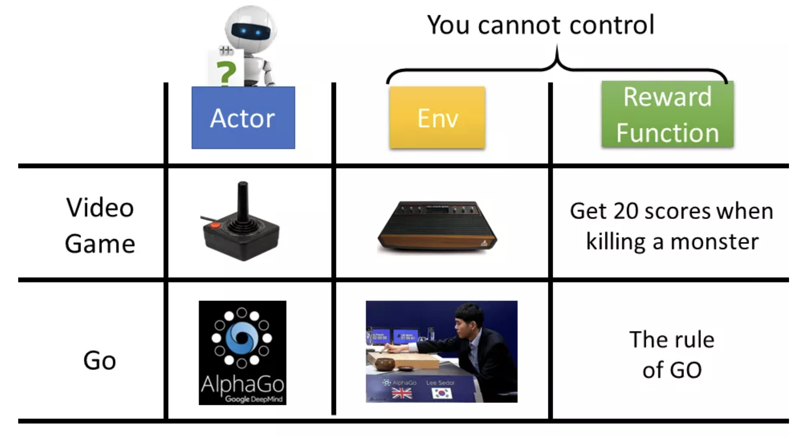
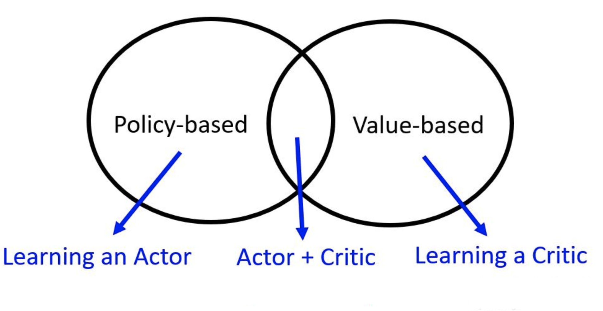
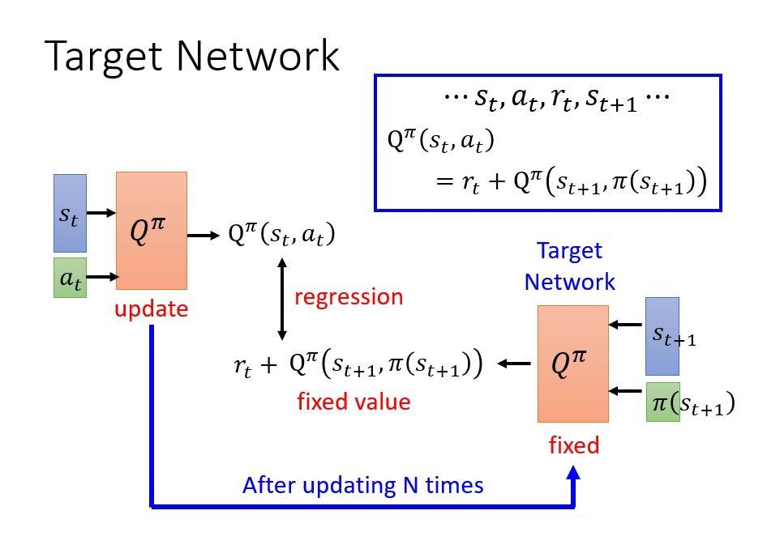
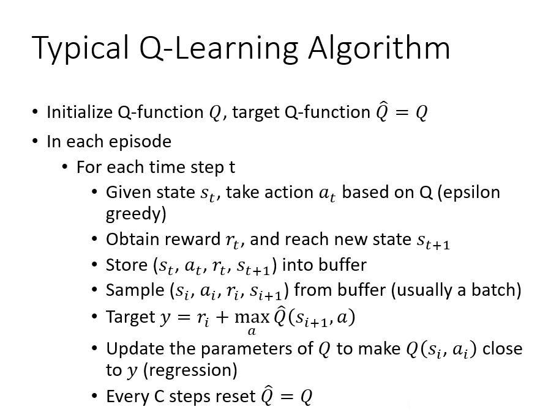
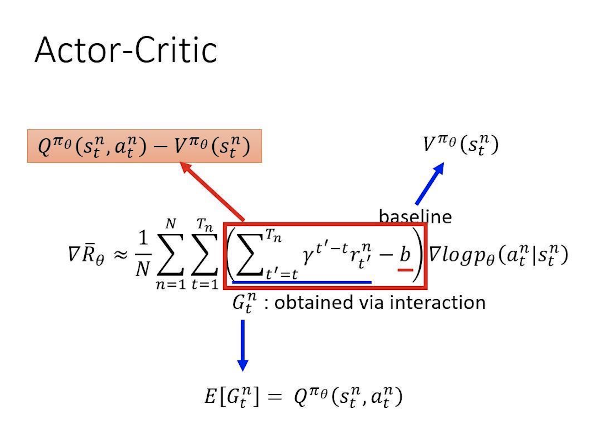
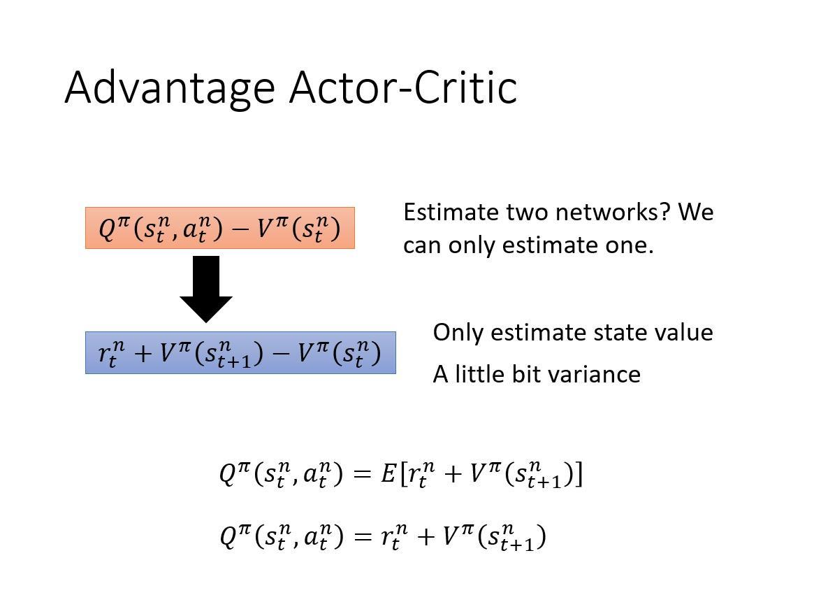
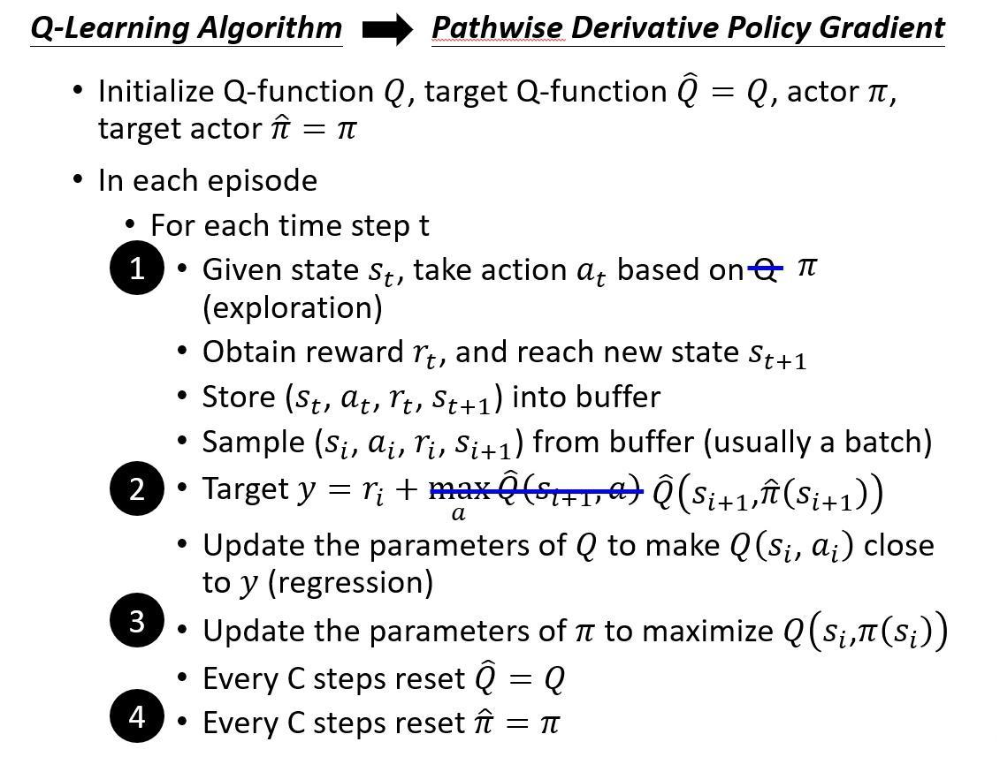

【LLM 004】一文入门强化学习

本文基于李宏毅的强化学习公开课整理，涉及内容包括：RL基础概念、Policy Gradient、PPO、Q-learning、Actor-Critic等。本文建议结合原始视频教程一起食用。看完后，对于RLHF可以有比较清晰的理解。

# 一、强化学习基础概念
强化学习一般包含三个要素：Actor、Env 和 Reward Function。
## 1.1 Actor
Actor 又称为 Policy，是强化学习中需要学习的对象。在基于神经网络的RL中，这几个名称通常是等价的：Actor $=$ policy $=\pi=$ network $=$ function。在一个基于游戏的RL中，Policy $\pi$ 一般是指参数为 $\theta$ 的网络，输入是Env的一个state（如游戏的画面），输出是一个action的分布（如“左移”、“右移”等）。在基于LLM的RLHF中，Policy是LLM，输入是prompt，输出的action是next token的概率分布。

## 1.2 Env
Env是指和Actor交互的环境，一般是游戏的规则等。在LLM中，是指要符合语法语义等规则的上文。

## 1.3 Reward Function

Reward Function是指在Actor和Env交互之后，得到的奖励。在游戏中，一般是指获得的分数或者是游戏的胜利等。在RLHF中，为了能够评估当前生成的文本的好坏，也会训练一个reward model。在一些场景下，可以用来评估当前policy好坏的reward也可以称为critic。

Actor、Env 和 Reward Function三者的示意图如下所示。

## 1.4 Trajectory

在 RL中，Actor 会和 Env 进行互动。假设当前Env的状态 $s_1$，Actor采取行动 $a_1$，对Env产生影响变成状态 $s_2$，然后Actor再采取行动 $a_2$ 。这样一直循环，直到达到终止条件，完成了一个episode。这时形成了一条trajectory。

假设一条trajectory一共有 $t$ 步，每一步的reward为 $r_t$，则一条trajectory 的 total reward为：$R(\tau)=\sum_{t=1}^T r_t$ 。

穷举所有的 trajectory，得到reward的期望值：
$$
\bar{R}_\theta=\sum_\tau R(\tau) p_\theta(\tau)=E_{\tau \sim p_\theta(\tau)}[R(\tau)] 
$$

Reward的期望值 $\bar{R}_\theta$ ，也就是RL最终要优化的目标。一条trajectory的概率计算示意图如下所示。

## 1.5 RL的基本分类

根据不同的学习策略，RL可以分为 Policy-based方法、Value-based方法和Actor-Critic 方法。其中，Policy-based方法是要通过训练一个Actor（也就是policy）来解决RL问题。Value-based 方法是训练一个Critic（也就是reward）来解决RL问题。Actor-Critic 则是两者的综合。

# 二、Policy-based方法

## 2.1 Policy Gradient

- 为了求的 $\bar{R}_\theta$ 的最大值，需要对其进行求导，然后进行梯度上升（reward求最大）求解。求导过程如下：

$$
\begin{aligned}
\nabla \bar{R}_\theta &=\sum_\tau R(\tau) \nabla p_\theta(\tau)=\sum_\tau R(\tau) p_\theta(\tau) \frac{\nabla p_\theta(\tau)}{p_\theta(\tau)} \\

& =\sum_\tau R(\tau) p_\theta(\tau) \nabla \log p_\theta(\tau) \\ 
& =E_{\tau \sim p_\theta(\tau)}\left[R(\tau) \nabla \log p_\theta(\tau)\right] \\

& \approx \frac{1}{N} \sum_{n=1}^N \sum_{t=1}^{T_n} R\left(\tau^n\right) \nabla \log p_\theta\left(a_t^n \mid s_t^n\right)

\end{aligned}
$$

​		其中第一行到第二行，用到了公式：$ \nabla f(x)= f(x) \nabla \log f(x)$， $R(\tau)$ 不一定需要可微，可以是一个黑盒。

- 得到梯度之后，一次迭代过程如下：首先使用 policy $\pi _\theta$ ，采样很多的 trajectory；然后使用这些数据，更新参数 $\theta$ ，之后再重新采用数据，不断进行迭代。

- RL 和一般的supervised learning的区别在于，一般的训练，模型参数更新之后，不会影响数据的标签。而在RL中，模型参数更新之后，Actor 和 Env互动的结果会随之改变，从而影响 label（或者 reward），使得每次更新参数之后，需要重新对数据进行采样。这样也训练成本很高。

- Policy Gradient的改进

  1. 增加一个baseline
     $$
     \nabla \bar{R}_\theta \approx \frac{1}{N} \sum_{n=1}^N \sum_{t=1}^{T_n}\left(R\left(\tau^n\right)-{b}\right) \nabla \log p_\theta\left(a_t^n \mid s_t^n\right) \\\quad b \approx E[R(\tau)]
     $$
     有些场景下reward可能一直是正数，且采样有一定的随机性，导致优化效果不太好。增加一个基准b，使得reward可以有正有负，更容易优化。

  2. 对reward进行加权
     $$
     \nabla \bar{R}_\theta \approx \frac{1}{N} \sum_{n=1}^N \sum_{t=1}^{T_n}\left(\sum_{t^{\prime}=t}^{T_n} \gamma^{t^{\prime}-t} r_{t^{\prime}}^n-{b}\right) \nabla \log p_\theta\left(a_t^n \mid s_t^n\right)
     $$
     reward从当前时刻t开始计算，t之前的reward可当前时刻t的action并没有关系。同时，增加了时间衰减系数，使得间隔较远的reward影响较小。

## 2.2 On-policy vs Off-policy

- 定义
  - On-policy：和环境交互的agent和要学习的agent是一个agent。
  - Off-policy：和环境交互的agent和要学习的agent不是一个agent。
  
- 前面的 policy gradient 的做法是 on-policy。当update参数以后，从 $\theta$ 变成 $\theta^{\prime}$，那么之前采样的数据就不能用了。Update一次参数，只能做一次梯度更新，而后再去重新搜集数据，非常耗时，所以需要 off-policy。off-policy可以基于同一批数据更新多次模型。为了使用off-policy，需要引入重要性采样。

- 重要性采样

  - 假设 $x$ 服从 $p$ 分布，想要计算 $f(x)$ 的期望，但是 $p$ 分布很难计算（采样）。于是引入一个比较容易计算（采样）的 $q$ 分布，于是在分子分母同时乘以 $q(x)$，于是就变成了服从 $q$ 分布的 $x$ 来求期望。
    $$
    E_{x \sim p}[f(x)]=E_{x \sim q}\left[f(x) \frac{p(x)}{q(x)}\right]
    $$
  注意上式中，左边是基于 $p$ 的分布，右边是基于 $q$ 的分布。
    
  - 根据上式可以知道，通过分布变换之后，期望值是相同的。但方差是否一致呢？根据公式 $\begin{aligned} & \operatorname{VAR}[X]   =E\left[X^2\right]-(E[X])^2\end{aligned}$ 分别计算两者的方差如下：
    $$
    \begin{aligned}  \operatorname{Var}_{x \sim p}[f(x)]& =E_{x \sim p}\left[f(x)^2\right]-\left(E_{x \sim p}[f(x)]\right)^2 \\ \operatorname{Var}_{x \sim q}\left[f(x) \frac{p(x)}{q(x)}\right] & =E_{x \sim q}\left[\left(f(x) \frac{p(x)}{q(x)}\right)^2\right]-\left(E_{x \sim q}\left[f(x) \frac{p(x)}{q(x)}\right]\right)^2 \\ & =E_{x \sim p}\left[f(x)^2 \frac{p(x)}{q(x)}\right]-\left(E_{x \sim p}[f(x)]\right)^2\end{aligned}
    $$
    可以看到，第二项是一致，区别主要在第一项，也就是 $\frac{p(x)}{q(x)}$ 。要使得在采样不充分的情况下，不出现较大的误差，则需要要求 ${p(x)}$ 和 $ {q(x)}$ 是两个比较接近的分布。

- 从On-policy到Off-policy
  $$
  \begin{aligned} 
  \text{On-policy:} \qquad & \nabla \bar{R}_\theta=E_{{\tau \sim p_\theta(\tau)}}\left[R(\tau) \nabla \log p_\theta(\tau)\right]  \\
  \text{Off-policy:}\qquad &\nabla \bar{R}_\theta=E_{\tau \sim p_{\theta^{\prime}}(\tau)}\left[\frac{p_\theta(\tau)}{p_{\theta^{\prime}}(\tau)} R(\tau) \nabla \log p_\theta(\tau)\right]
  \end{aligned}
  $$
  其中， $\theta^{\prime}$ 是固定的，从中采样一次数据, 可以给 $\theta$ 更新很多次，完了以后再去采样数据。

  由于要使用Off-policy，节省多次采样数据的时间，因此，在RLHF中，需要有`actor_model`和`ref_model`。同时，为了能够满足重要性采样的条件，需要使得`actor_model`和`ref_model` 输出的分布比较接近。
  
- Off-policy的梯度更新
  $$
  \begin{aligned}  \nabla \bar{R}_\theta& =E_{\left(s_t, a_t\right) \sim \pi_\theta}\left[A^\theta\left(s_t, a_t\right) \nabla \log p_\theta\left(a_t^n \mid s_t^n\right)\right] \\ & =E_{\left(s_t, a_t\right) \sim \pi_{\theta^{\prime}}}\left[\frac{P_\theta\left(s_t, a_t\right)}{P_{\theta^{\prime}}\left(s_t, a_t\right)} A^\theta\left(s_t, a_t\right) \nabla \log p_\theta\left(a_t^n \mid s_t^n\right)\right]\end{aligned}
  $$
  其中 $A^\theta\left(s_t, a_t\right)$ 代表reward，等价于 $R(\tau)$。经过推导，最终得到优化目标
  $$
  J^{\theta^{\prime}}(\theta)=E_{\left(s_t, a_t\right) \sim \pi_{\theta^{\prime}}}\left[\frac{p_\theta\left(a_t \mid s_t\right)}{p_{\theta^{\prime}}\left(a_t \mid s_t\right)} A^{\theta^{\prime}}\left(s_t, a_t\right)\right]
  $$

## 2.3 PPO/TRPO

- 在重要性采样中，提到替换的分布和替换之前的分布不能差别太大，因此需要增加一个限制条件，保证 $\theta$ 和 $\theta^\prime$  是比较接近的。衡量两个分布是否接近的指标，就是KL散度。

- TRPO

  - TRPO 在损失函数之外，增加了一个限制条件，保证两个分布的相似性

  $$
  J_{T R P O}^{\theta^{\prime}}(\theta)=E_{\left(s_t, a_t\right) \sim \pi_{\theta^{\prime}}}\left[\frac{p_\theta\left(a_t \mid s_t\right)}{p_{\theta^{\prime}}\left(a_t \mid s_t\right)} A^{\theta^{\prime}}\left(s_t, a_t\right)\right]  \\
  K L\left(\theta, \theta^{\prime}\right)<\delta
  $$

- PPO

  - TRPO可以限制两个分布的相似性，但是因为限制条件是单独存在，不好求解。因此，PPO对其进行了改进，变成了损失函数的一部分。
    $$
    J_{P P O}^{\theta^{\prime}}(\theta)=J^{\theta^{\prime}}(\theta)-\beta K L\left(\theta, \theta^{\prime}\right)
    $$

  - PPO的整体流程

    

  - PPO2：针对不同大小的KL散度，自动调节 $\beta$ 值的大小。
    $$
    \begin{aligned} J_{P P O 2}^{\theta^k}(\theta) \approx & \sum_{\left(s_t, a_t\right)} \min \left(\frac{p_\theta\left(a_t \mid s_t\right)}{p_{\theta^k}\left(a_t \mid s_t\right)} A^{\theta^k}\left(s_t, a_t\right)\right. \\ & \left.\operatorname{clip}\left(\frac{p_\theta\left(a_t \mid s_t\right)}{p_{\theta^k}\left(a_t \mid s_t\right)}, 1-\varepsilon, 1+\varepsilon\right) A^{\theta^k}\left(s_t, a_t\right)\right)\end{aligned}
    $$
    

# 三、Value-based方法

- 在机器学习中，通过需要有反馈信号，告诉模型当前的输出的结果的好坏。在分类等supervised-learning中，可以将预测结果和label进行比对，通过accuracy、f1等指标，即可得到预测结果的好坏。而在文本生成、游戏等场景下，一个action的好坏评估并不是那么显而易见。通过一个模型，对输出进行打分，给到有效的反馈信号，可以方便算法的迭代。
- Value-based方法中的critic，就可以起到这样的作用。critic并不会直接决定当前状态下要采取的action，对于给定的policy $\pi$ ，critic可以给出这个策略的分数。Q-learning是一种常见的value based方法，此时学习的并不是policy，而是一个critic。

## 3.1 Critic的两种方式

- 状态价值函数 $V^\pi(s)$ ：使用policy $\pi$ 时，在状态 $s$ 之后，可以累积获得的reward的期望。$V^\pi(s)$ 的值，和policy $\pi$ 有很大的关系，不同的 $\pi$ ，在共同的状态 $s$ 之下，可以有不同的值
- 状态 - 行为价值函数 $Q^\pi(s, a)$ ：使用policy $\pi$ 时，在状态 $s$ 并采取行动 $a$ 之后，可以累积获得的reward的期望（只适用于离散的actor，连续的话没法使用）

-  状态价值函数$V^\pi(s)$ 的估计方法
  - 蒙特卡洛方法（MC）：从状态 $s$ 开始，一直到实验结束，不断重复这个过程。将所有过程的reward值，取均值，作为 $V^\pi(s)$ 的估计值。
  - 时间差分算法（TD）：根据状态 $s_t$ 和 $s_{t+1}$ 之间的差值，进行估计。$V^\pi\left(s_t\right)-V^\pi\left(s_{t+1}\right) \leftrightarrow r_t$ 
  - MC方差更大，但更精确。TD方差小，但没有MC精确。TD更常用。

## 3.2 Q-learning

- 基本思路

  - 当可以通过MC或者TD，求解得到 $Q^\pi(s, a)$ 后，使用 $Q^\pi(s, a)$  可以找到一个新的 $\pi^{\prime}$ 比之前的policy $\pi$ 要更好。这就是Q-learning方法的基本思路。
  - "Better": $V^{\pi^{\prime}}(s) \geq V_0^\pi(s)$, for all state $\mathrm{s}$

  $$
  \pi^{\prime}(s)=\arg \max _a Q^\pi(s, a)
  $$

 

- 目标网络（Target Network）

  - 由定义可知 $ \mathrm{Q}^\pi\left(s_t, a_t\right) =r_t+\mathrm{Q}^\pi\left(s_{t+1}, \pi\left(s_{t+1}\right)\right)$ 。但是，当在训练的过程中，如果两个Q同时进行更新，网络会难以进行训练。因此，会将 $\mathrm{Q}^\pi\left(s_{t+1}, \pi\left(s_{t+1}\right)\right)$ 固定，这样方便进行优化。

  - 此处由于有Target Network的存在，在RLHF中，也会有`critic_model`和`reward_model`两个模型，其中`critic_model`会更新参数，而`reward_model`的参数会固定。

- Q-learning 的整体过程

- Q-learning的改进建议
  - Double DQN
  - Dueling DQN
  - Multi-step方法
  - Noisy Net
  - Distributional Q-function

# 四、Actor-Critic方法

## 4.1 Actor-Critic

在policy gradient中，
$$
\nabla \bar{R}_\theta \approx \frac{1}{N} \sum_{n=1}^N \sum_{t=1}^{T_n}\left(\sum_{t^{\prime}=t}^{T_n} \gamma^{t^{\prime}-t} r_{t^{\prime}}^n-{b}\right) \nabla \log p_\theta\left(a_t^n \mid s_t^n\right)
$$
其中，$\sum_{t^{\prime}=t}^{T_n} \gamma^{t^{\prime}-t} r_{t^{\prime}}^n$ 是从时刻 $t$ 开始，采取action $a_t^n$ 之后的reward， $b$ 是一个baseline，使得reward可以有正有负。

在 Q-learning中，我们使用了状态 - 行为价值函数 $Q^\pi(s, a)$ 表示在状态 $s$ 并采取行动 $a$ 之后，可以累积获得的reward的期望。同时，可以将baseline 的 $b$ 取值为 $V^{\pi _\theta}\left(s_t^n\right)$ ，就可以将policy gradient 和 Q-learning 结合起来。

## 4.2 Advantage Actor-Critic

- Actor-Critic此时还需要同时优化两个函数，如果估计的不够准确，会带来两倍的误差。因此，想要进一步简化计算。根据$V^\pi(s)$ 和 $Q^\pi(s, a)$ 的定义，并作一定的近似，得到了Advantage Actor-Critic，简称A2C。

- 最终的梯度为：

$$
\nabla \bar{R}_\theta \approx \frac{1}{N} \sum_{n=1}^N \sum_{t=1}^{T_n}\left(r_t^n+V^\pi\left(s_{t+1}^n\right)-V^\pi\left(s_t^n\right)\right) \nabla \log p_\theta\left(a_t^n \mid s_t^n\right)
$$

## 4.3 Pathwise Derivative Policy Gradient

- A2C中，critic可以给出当前action的好坏，但没法给出当前可以执行的最好的action。进一步改进，得到Pathwise Derivative Policy Gradient。此时，将Actor的输出给到Critic，并且在训练中使得Critic的打分最高。这里比较类似GAN的训练方法，其中Actor类似于GAN中的generator，Critic类似于GAN中的discriminator。
- Pathwise Derivative Policy Gradient的算法流程如下：

- 可以看到，RLHF中的PPO使用的就是Pathwise Derivative Policy Gradient。actor_model和ref_model分别对应 actor $\pi$ 和 target actor $\hat\pi$。 critic_model和reward_model分别对应$Q$和$\hat Q$。

## 参考资料 

- https://blog.51cto.com/u_15721703/5575736
- 详解大模型RLHF过程（配代码解读） - 战士金的文章 - 知乎
  https://zhuanlan.zhihu.com/p/624589622
- 李弘毅深度强化学习笔记【1 Policy Gradient 】 - 残血的三井寿的文章 - 知乎
  https://zhuanlan.zhihu.com/p/66291401
- 【李弘毅深度强化学习】2，Proximal Policy Optimization (PPO) - 残血的三井寿的文章 - 知乎
  https://zhuanlan.zhihu.com/p/66302483

