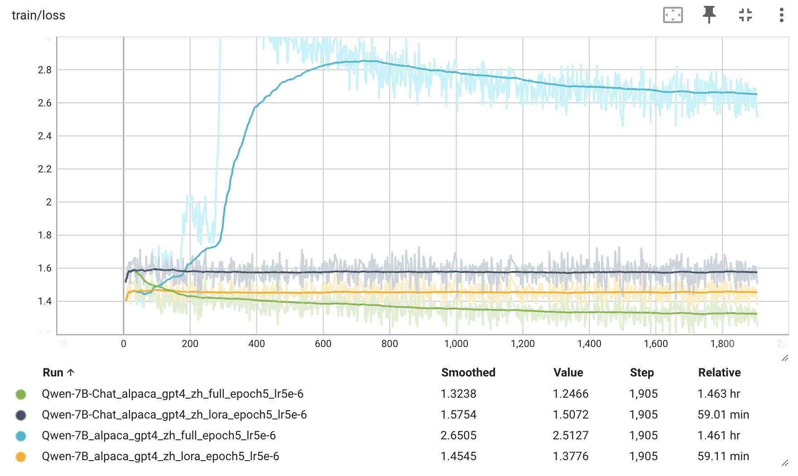
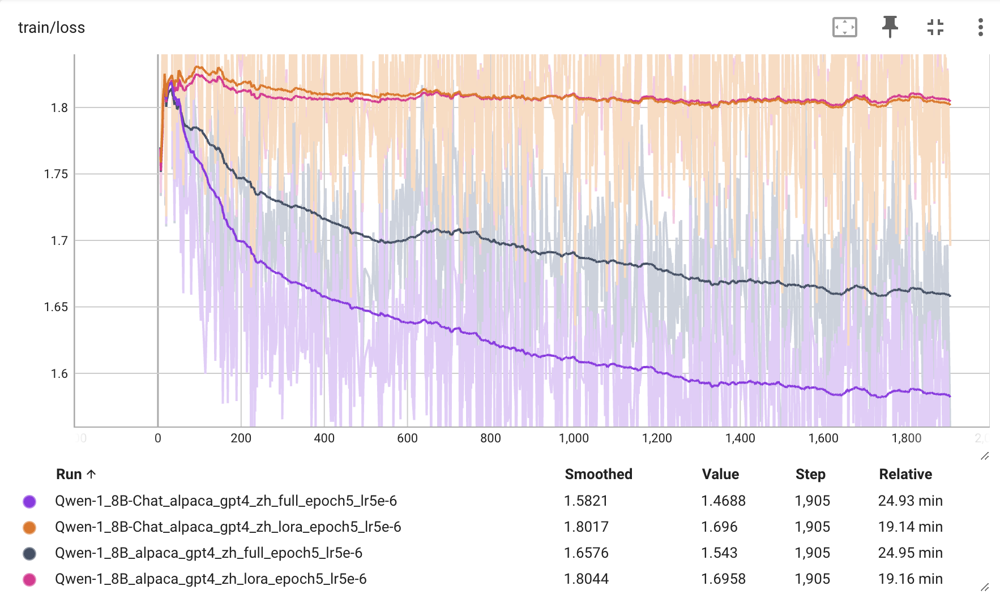
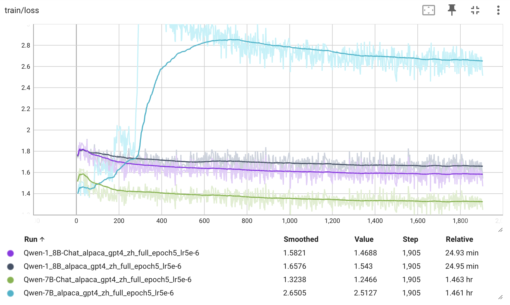
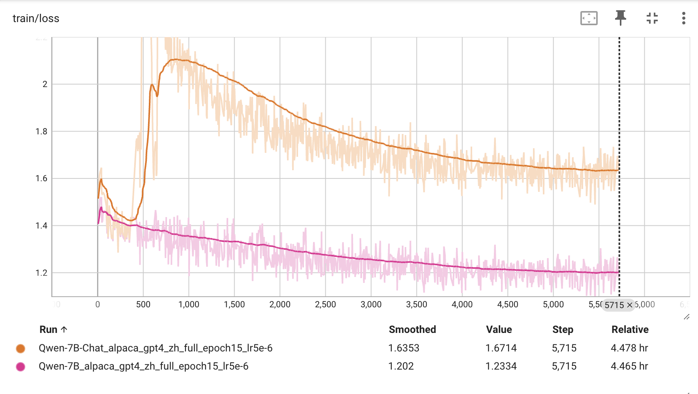
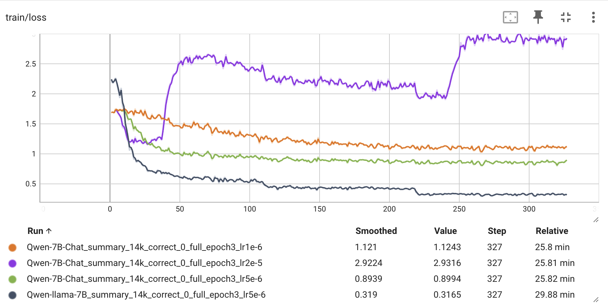
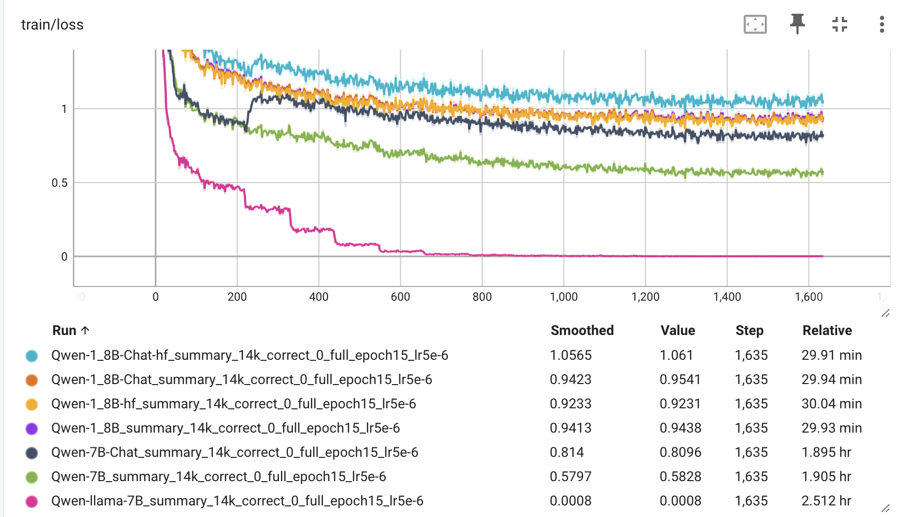

# 时间戳实验

### 模型选择

- Chat 模型优于预训练模型（loss更低，更稳定）

- Full 优于 lora（loss更低）

- 7B优于1.8B

  





- chat也有可能飞，可能lr太大？




- Modelscope 下载的qwen有问题？待确认





```
# model_name_or_path = '/root/paddlejob/workspace/env_run/output/model/dpo_Qwen-llama-7B_summary_14k_correct_0_rm_full_epoch3_lr5e-6'

Human: 视频信息如下，请对其进行分段和总结。
标题：5种耐阴的花，没光也能养好，养在阳台客厅高端大气又好养。正文：0:大家好欢迎收看小陌知百科我是小陌,2:5种超级耐阴的花没光也能养爆盆。,6:养在阳台客厅超有范儿,9:1紫露兰紫露兰同样也是一款,12:比较小众的盆栽绿植,15:有着紫若胭脂四季长虹的美好寓意,18:虽说是绿植吧但是它的叶子色彩斑斓澜,22:如油画般跟油画吊兰有的一拼,25:紫露兰喜欢温暖湿润光线明亮的环境,28:耐半阴怕寒冷,30:2青白玉吊兰,33:青白玉吊兰是一款特别特别小清新的绿植,36:叶子椭圆形白绿两色相间超级的漂亮,40:美得清新脱俗,41:3竹芋竹芋只是一个统称,44:它下面的品种可多着呢有苹果竹芋,47:猫眼竹芋彩虹竹芋双线竹芋等等,50:大家可根据自己的喜好选择,53:4彩叶芋有一种植物叶子比花还美,57:这种植物就是彩叶芋尤其是那种宽大的叶片,61:上面颜色是半透明的浅淡的白色的或者浅粉色的,66:真是仙气飘飘呀,67:5仙洞龟背竹作一看还以为这是,71:龟背竹叶片上被虫子咬出来的洞洞,74:其实这是它自然形成的它原本就是这样的,79:是不是非常的有特点呢,80:仙洞龟背竹的价格大概在20元左有,83:如果要配一个更好看的陶瓷花盆的话,86:价格也会更加的高一些,89:这5种花卉你家里有吗,91:好了本期视频到这里就结束了,92:咱们下期再见 。视频信息结束，开始分段总结。
Assistant:0:五种超级耐阴。9::紫露兰。三十::青白玉吊兰。四十一::竹芋品种多。五十-three::彩叶芋叶子比花美。八十九::再见<|endoftext|>

Assistant:
0:5种超级耐阴的花。9:紫露兰。30:青白玉吊兰。41:竹芋。53:彩叶芋。67:仙洞龟背竹<|endoftext|>

Human: 视频信息如下，请对其进行分段和总结。
标题：饺子馅好吃有诀窍，教你饭店不外传的调馅配方，鲜嫩多汁真香。正文：0:大家好我是豆妈,1:今天和大家分享,3:像饭店一样好吃的饺子馅做法,5:先煮大料水,6:桂皮一块香叶两片,8:八角两个花椒一小撮,11:倒入200毫升清水,12:这个水量根据肉的多少而定,15:一般1斤肉放2量水,17:大火煮开后再煮5分钟,19:放凉后过滤到杯中备用,22:梅花肉两块大约2斤重,24:切成小块后再剁碎,26:很多朋友说机器搅的肉馅没有灵魂,29:用刀剁的肉馅,30:肯定要比机器绞碎的肉馅口感更好,32:因为手工剁的肉馅,34:没有破坏肉纤维组织结构,36:吃起来有嚼劲,38:更香更好吃,40:剁到像这种带有小颗粒状态就行了,42:把肉馅收入盆中,45:先放一勺盐搅拌均匀,47:再分次放入大料水,49:每次加水搅打至完全吸收上劲后,52:再次加水,53:大料水,54:不仅能让肉馅滑嫩适口,56:同时还有去腥味的作用,58:接着放胡椒粉,60:放两勺生抽,61:勺蚝油,63:半勺老抽调色,65:最后放两勺芝麻油提香,68:基础肉馅就调好了,70:放冰箱冷藏腌制1个小时,72:冷藏后的肉馅,74:更入味更好包,75:包的时候再把素菜放入肉馅中拌匀,79:我用的是韭菜,80:韭菜做馅易发黄,83:可以向韭菜碎中放少许苏打水,86:两克苏打用少许清水化开,89:把苏打水倒入韭菜碎中,91:搅拌均匀,92:这样煮好的饺子翠绿不发黄,95:淋入两勺植物油拌匀防止韭菜出水,99:把韭菜碎倒入肉馅中拌匀,101:韭菜猪肉馅就调好了,103:这样调的饺子馅保证鲜美嫩滑,107:快动手试试吧,108:有问题咱们留YQ交流 。视频信息结束，开始分段总结。
Assistant:
0:分享饺子做法。5::大料水。22::梅花肉剁碎。 forty::小颗粒状态。五十十四::去腥味作用。七十十八::入味更好包。十一百::鲜美嫩滑。<|endoftext|>

0:豆妈分享饺子馅做法。5:煮大料水。22:梅花肉剁碎。42:加调料搅拌。70:冷藏腌制。75:包饺子<|endoftext|>

```


```
A chat between a curious user and an artificial intelligence assistant. The assistant gives helpful, detailed, and polite answers to the user's questions.
Human: 视频信息如下，请对其进行分段和总结。
标题：“莅”字的读音、笔顺、释义，以及组词、造句的技巧。正文：1:同学们大家好,4:今天我们一起学习汉字,7:在学习之前我们先猜个谜语,10:一人立于草下打一字,14:答案就是我们今天要学习的“莅”字,18:这个字读,21:--四声,24:下面我们一起来看一下这个字是怎么写的吧,29:这是一个上下结构的字,32:它的部首是,34:让我们来写一写吧,37:笔顺是横坚坚坚点横点横,55:你知道这个字有多少划了吗,58:没错是十划,62:接下来我们看下这个字是什么意思,67:莅的意思是到,69:比如我们可以组词“莅临”,73:让我们用这个词造个句吧,76:“上级领导将会在下周位临我校检查工作,82:好了让我们再来复习一下莅字的写法吧,89:横坚坚坚点横点撇横,106:同学们你们学会了吗 。视频信息结束，开始分段总结。
Assistant:
69:莅的意思<|endoftext|>

```

