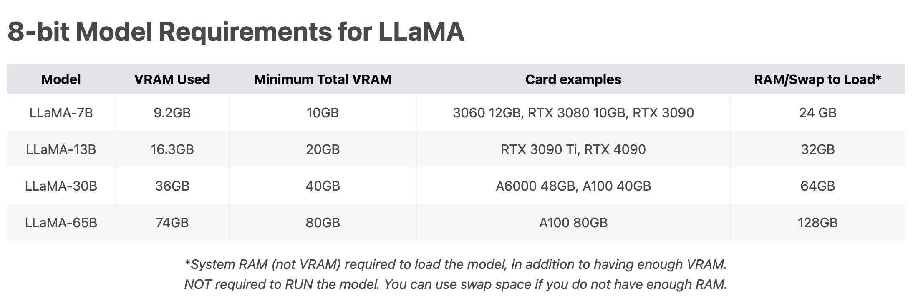
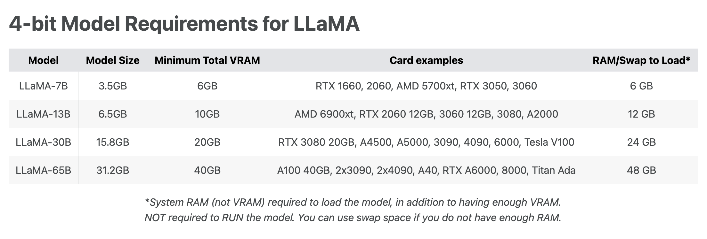

# LLaMa美国骆驼

- Blog: https://ai.facebook.com/blog/large-language-model-llama-meta-ai/
- LLaMA-13B 在大部分基准测评上超过了 GPT3（175B）
- Model card: https://github.com/facebookresearch/llama/blob/main/MODEL_CARD.md

| Number of parameters | dimension | n heads | n layers | Learn rate | Batch size | n tokens |
| -------------------- | --------- | ------- | -------- | ---------- | ---------- | -------- |
| 7B                   | 4096      | 32      | 32       | 3.0E-04    | 4M         | 1T       |
| 13B                  | 5120      | 40      | 40       | 3.0E-04    | 4M         | 1T       |
| 33B                  | 6656      | 52      | 60       | 1.5.E-04   | 4M         | 1.4T     |
| 65B                  | 8192      | 64      | 80       | 1.5.E-04   | 4M         | 1.4T     |

- 知乎介绍文章：https://zhuanlan.zhihu.com/p/612752963
- 训练所用的数据：约4TB，而GLM大约为156GB。大了约25倍
- 
  - source: https://rentry.org/llama-tard-v2#3-updated-hfv2-converted-llama-weights

- 

https://aituts.com/llama/

# Alpaca羊驼

- Data：52K instruction-following examples
- 7B的LLaMa，在8卡的80GVB的A100上，训练3小时。

- 和 text-davinci-003 有相同的性能表现
- https://github.com/tatsu-lab/stanford_alpaca

# Vicuna骆马

- https://github.com/lm-sys/FastChat
- Vicuna是基于LLaMA-13B模型的，Vicuna-13B 通过微调 LLaMA 实现了高性能的对话生成。这一点和斯坦福之前的 Alpaca 模型类似，但 Vicuna 比 Alpaca 的生成质量更好，速度也更快。
- Vicuna借鉴了 Meta LLaMA 和 Stanford Alpaca 项目的思路，利用来自 ShareGPT 的用户共享数据进行学习。ShareGPT 可以说是 AI 领域的一个宝藏网站，上面有许多用户上传的有趣而又有价值的 ChatGPT 回答，而 Vicuna 就是通过这些分享数据得以更加精准地进行推理和回答的。
- 从这个角度来看，**Vicuna相当于升级版的Alpaca**，Alpaca用的指令数据只有52K，而Vicuna用的ShareGPT的数据则更加丰富。
- 当然，不只是训练数据更加丰富，Vicuna在[内存优化](https://www.zhihu.com/search?q=内存优化&search_source=Entity&hybrid_search_source=Entity&hybrid_search_extra={"sourceType"%3A"article"%2C"sourceId"%3A"620206378"})（比如最大上下文长度从 512 扩展到 2048），多轮对话、降低成本方面也是做了很多工作，这里就不一一展开了。

- 细数和Chatgpt相似的开源模型 - AI科技视野的文章 - 知乎 https://zhuanlan.zhihu.com/p/620206378

# BELLE

- https://github.com/LianjiaTech/BELLE

# ColossalAI

- https://github.com/hpcaitech/ColossalAI