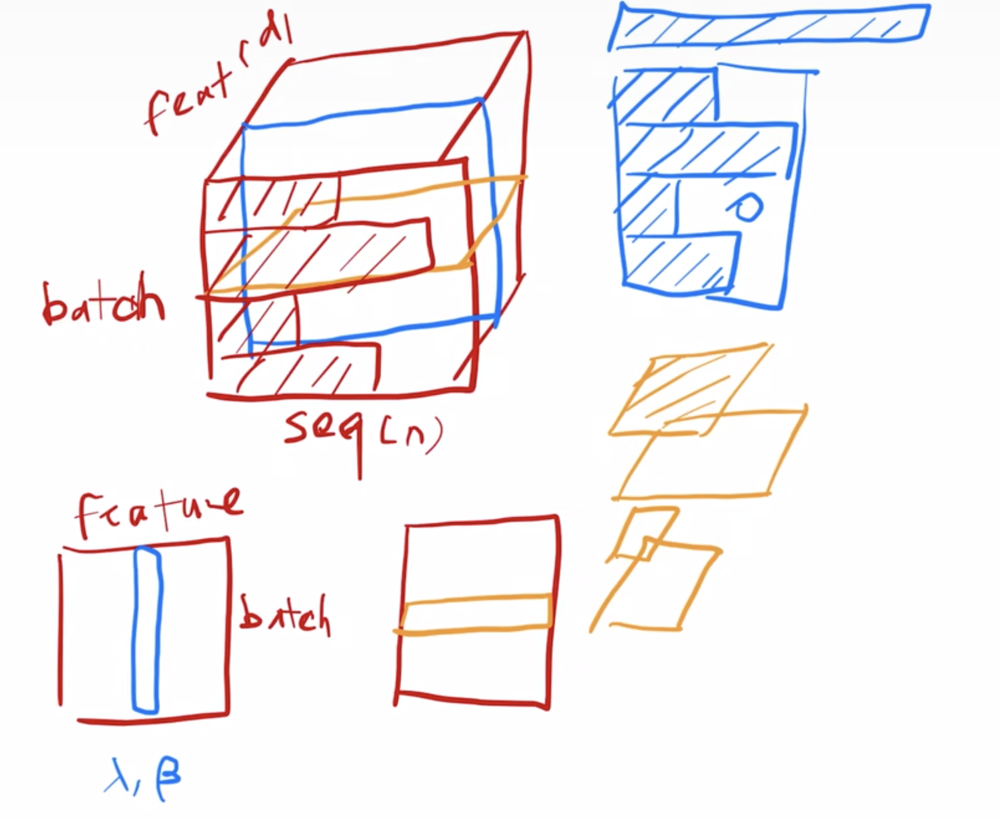

# Code

- 介绍DPO
- 

- bn vs ln

  - 二维的情况下，bn对feature进行归一化（列归一化），ln对样本进行归一化（行归一化）

  - 三维的情况下，如下所示

  - 

  - torch.nn.LayerNorm(normalized_shape)：https://pytorch.org/docs/stable/generated/torch.nn.LayerNorm.html

    - normalized_shape，是alpha 和beta的维度。计算mean和var，是在normalized_shape的维度数量上进行。比如normalized_shape是二维矩阵，则在倒数2个维度上计算。

    - ```python
      ln_input = torch.randn([2,3,4])
      def layer_norm(x, eps=1e-5):
          alpha = torch.nn.Parameter(torch.ones(x.shape[-1]))
          beta = torch.nn.Parameter(torch.zeros(x.shape[-1]))    
          mean = torch.mean(x, dim=-1, keepdim=True)
          var = torch.var(x, dim=-1, keepdim=True, unbiased=False)
          output = (x - mean) / torch.sqrt(var + eps)
          output = output * alpha + beta
          return output
      
      ln = torch.nn.LayerNorm(4)
      print("torch layer norm:\n", ln(ln_input))
      print("our laryer norm:\n", layer_norm(ln_input))
      ```

  - torch.nn.BatchNorm2d(channel)：https://pytorch.org/docs/stable/generated/torch.nn.BatchNorm2d.html

    - ```python
      bn_input = torch.randn([2,3,4,4])
      
      def batch_norm(x, eps=1e-5):
          alpha = torch.nn.Parameter(torch.ones(x.shape[1]))
          beta = torch.nn.Parameter(torch.zeros(x.shape[1]))
          mean = torch.mean(x, dim=(0, 2, 3), keepdim=True)
          var = torch.var(x, dim=(0, 2, 3), keepdim=True)
          output = (x - mean) / torch.sqrt(var + eps)
          output = output * alpha.view(1, -1, 1, 1) + beta.view(1, -1, 1, 1)
          return output
      
      bn = torch.nn.BatchNorm2d(3)
      print("torch bn output:\n", bn(bn_input))
      print("our bn output:\n", batch_norm(bn_input))
      ```

  - |                    | bn             | ln          |
    | ------------------ | -------------- | ----------- |
    | 输入数据维度       | （2，3，4，4） | （2，3，4） |
    | 计算均值方差的数量 | 3              | 2*3         |
    | alpha、beta的维度  | 3              | 4           |

  - 

- info nce loss

  ```python
  import torch
  import torch.nn.functional as F
  
  def info_nce_loss(image_features, text_features, temperature=0.07):
      """
      CLIP的InfoNCE Loss实现
  
      参数:
          image_features: 图像特征矩阵，维度为 (batch_size, feature_dim)
          text_features: 文本特征矩阵，维度为 (batch_size, feature_dim)
          temperature: 控制loss的精细度
  
      返回:
          loss: InfoNCE loss 的标量值
      """
      # 归一化特征
      image_features = torch.nn.functional.normalize(image_features, p=2, dim=1)
      text_features = torch.nn.functional.normalize(text_features, p=2, dim=1)
  
      # 计算图像和文本的logits
      logits = torch.matmul(image_features, text_features.T) / temperature
  
      # 为每个图像和文本对应生成标签
      labels = torch.arange(logits.size(0)).to(logits.device)
      
      # 计算图像到文本和文本到图像的loss
      image_loss = F.cross_entropy(logits, labels)
      text_loss = F.cross_entropy(logits.T, labels)
      
      # 计算总loss
      loss = (image_loss + text_loss) / 2
  
      return loss
  
  # 示例
  batch_size = 4
  feature_dim = 512
  
  # 随机生成图像和文本特征
  image_features = torch.randn(batch_size, feature_dim)
  text_features = torch.randn(batch_size, feature_dim)
  
  # 计算loss
  loss = info_nce_loss(image_features, text_features)
  print(loss)
  ```

- cross entropy loss

  - https://cloud.tencent.com/developer/article/1879174

  ```python
  import numpy as np
  
  def softmax(logits):
      e_logits = np.exp(logits - np.max(logits, axis=1, keepdims=True))
      return e_logits / np.sum(e_logits, axis=1, keepdims=True)
  
  def cross_entropy_loss(predictions, labels):
      """
      手动计算交叉熵损失
  
      参数:
      predictions: 模型输出的 raw 分数（logits）
      labels: 真实的标签索引数组
  
      返回:
      损失的平均值
      """
      m = labels.shape[0]
      p = softmax(predictions)
      log_likelihood = -np.log(p[range(m), labels])
      loss = np.sum(log_likelihood) / m
      return loss
  
  # 示例 logits 和标签
  predictions = np.array([[2.0, 1.0, 0.1], [0.1, 1.0, 2.0]])
  labels = np.array([0, 2])
  
  # 计算损失
  loss = cross_entropy_loss(predictions, labels)
  print(loss)
  ```

- 不使用库函数，实现线性回归

  ```python
  # 假设 X 是一个形状为 (n, m) 的矩阵，其中 n 是数据点的数量，m 是特征的维度
  # Y 是一个形状为 (n, 1) 的向量，包含每个数据点的目标值
  
  # 初始化模型参数
  def initialize_parameters(dim):
      w = [0] * dim
      b = 0
      return w, b
  
  # 预测模型输出
  def predict(x, w, b):
      return sum([x[i] * w[i] for i in range(len(w))]) + b
  
  # 计算损失函数和梯度
  def compute_gradient(X, y, w, b):
      n = len(y)
      dw = [0] * len(w)
      db = 0
      
      # 总损失
      total_loss = 0
      
      # 遍历每个数据点计算梯度和损失
      for i in range(n):
          y_pred = predict(X[i], w, b)
          loss = y_pred - y[i]
          total_loss += loss ** 2
          for j in range(len(w)):
              dw[j] += (2/n) * loss * X[i][j]
          db += (2/n) * loss
          
      # 计算均方误差
      mse = total_loss / n
      
      return dw, db, mse
  
  # 批量梯度下降
  def batch_gradient_descent(X, y, w, b, learning_rate, epochs):
      for epoch in range(epochs):
          dw, db, mse = compute_gradient(X, y, w, b)
          
          # 更新参数
          w = [w[i] - learning_rate * dw[i] for i in range(len(w))]
          b = b - learning_rate * db
          
          # 打印损失
          if epoch % 100 == 0:
              print(f"Epoch {epoch}: Mean Squared Error: {mse}")
      
      return w, b
  
  # 示例数据和批量梯度下降
  # 假设有两个特征和五个数据点
  X = [
      [1, 2],
      [2, 3],
      [3, 4],
      [4, 5],
      [5, 6],
  ]
  y = [5, 7, 9, 11, 13]
  
  # 参数初始化
  w, b = initialize_parameters(2)
  
  # 训练模型
  w, b = batch_gradient_descent(X, y, w, b, learning_rate=0.01, epochs=1000)
  
  # 输出最终的权重和偏差
  print(f"Final weights: {w}, Final bias: {b}")
  ```

  