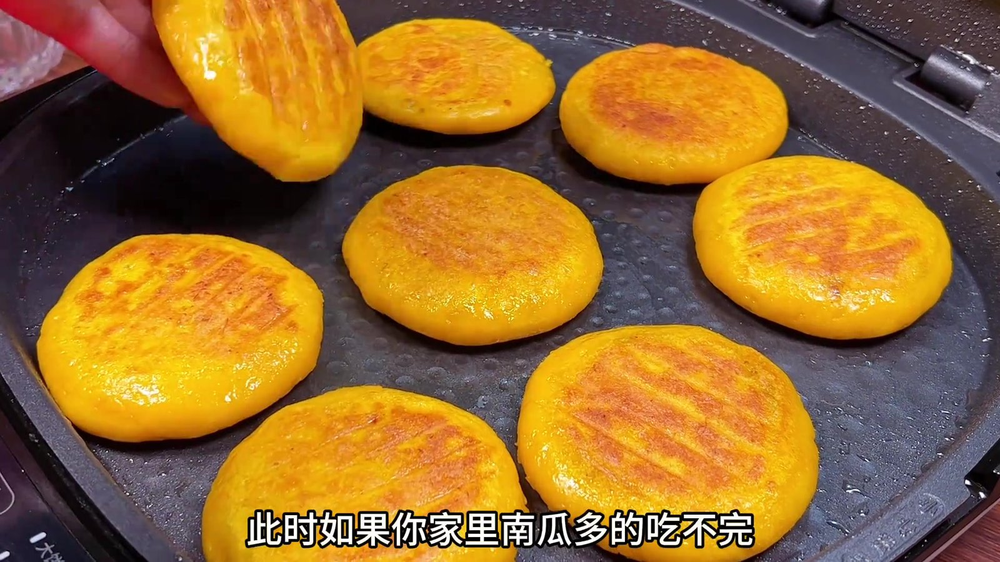
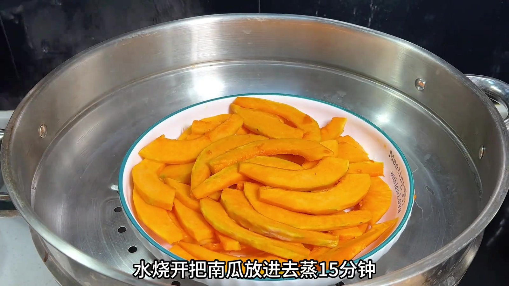
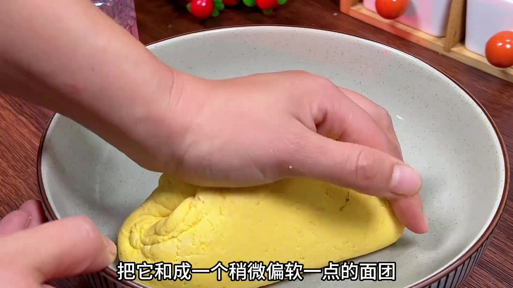
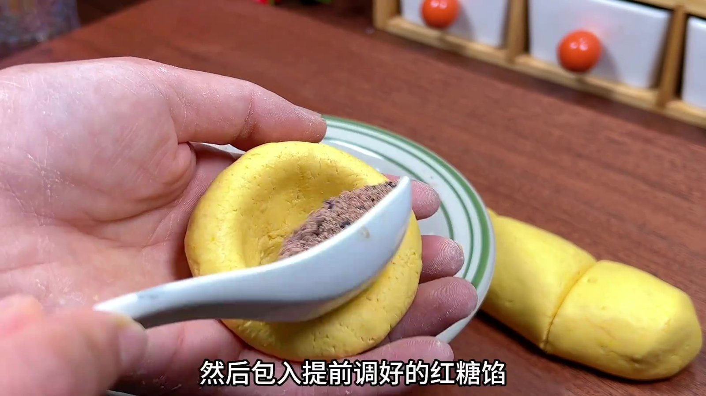
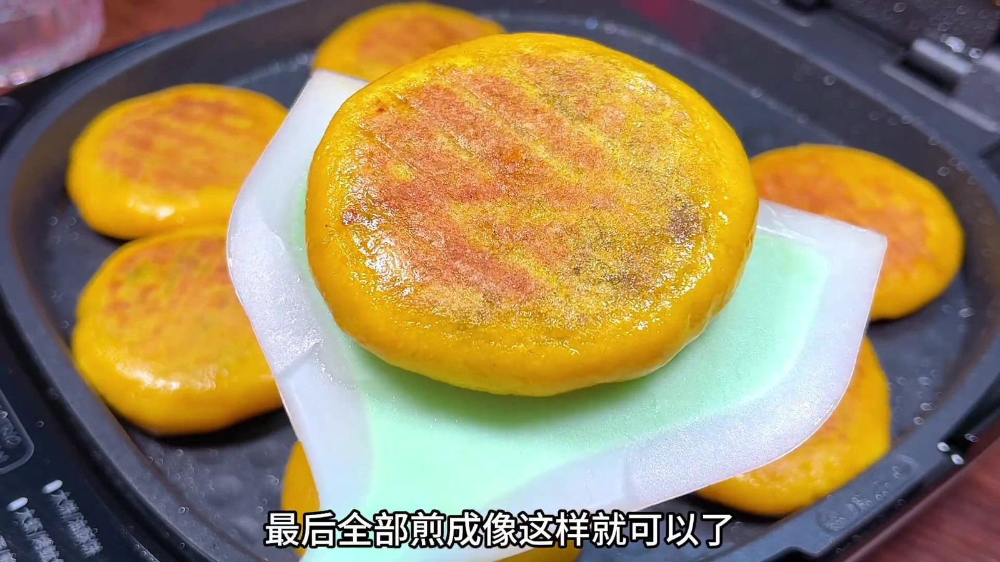
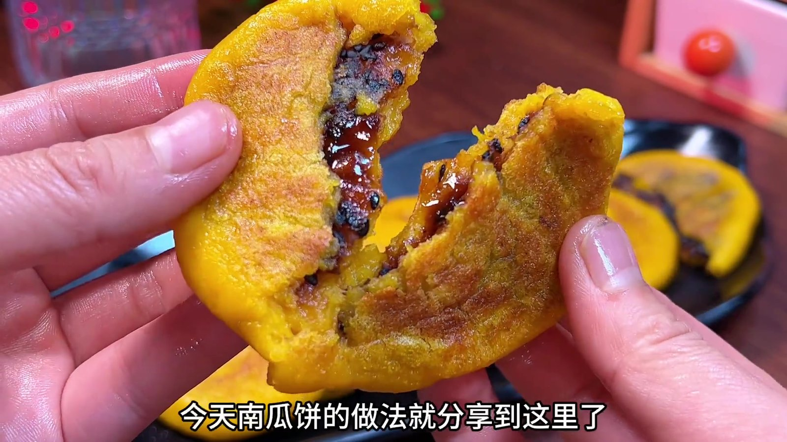

|      | 00:00 【开始制作南瓜饼】 此时如果你家里南瓜多的吃不完，一定要试试这个南瓜饼的做法，很多人不知道加面粉还是加糯米粉，今天教你正确的做法，软糯香甜又好吃，一点不腻。 |
| ---- | ------------------------------------------------------------ |
| 1    |                                   |

|      | 00:12 【准备食材】 首先准备一块南瓜，把皮削去之后再切成薄片，切好的南瓜装在大一点的盆中，水烧开后，把南瓜放进去蒸15分钟，把南瓜蒸熟蒸烂。接下来准备一个大碗，调一个红糖馅，往里面加入两勺红糖，一勺面粉、一勺黑芝麻，把它完全混合均匀，调好的红糖馅放在一边备用。 |
| ---- | ------------------------------------------------------------ |
| 2    |                                      |

|      | 00:36 【和面过程】 蒸好的南瓜倒在盆中。我每天都用心分享家常美食，发了这么多条还没得到您的赞，这个视频麻烦帮我点一个吧，谢谢！加入适量的糯米粉，把它和成一个稍微偏软一点的面团，这样做出来比较软糯比较好吃，不要和得太硬了，硬了口感不好。 |
| ---- | ------------------------------------------------------------ |
| 3    |                                      |

|      | 00:57 【包馅过程】 然后再分成小剂子，取其中一个搓一下整理好，然后包入提前调好的红糖馅。然后按压成饼状，像这样一个生坯就做好了，全部做好摆在托盘里。 |
| ---- | ------------------------------------------------------------ |
| 4    |                                      |

|      | 01:07 【煎制南瓜饼】 接下来电饼铛预热，喷上一点油，把做好的饼坯放进去，盖上盖子先烙两分钟，时间到了，打开翻一下，尽量不要让它们挨在一起，不然会粘在一起，再翻过来就熟了，总共煎了五六分钟，糯米粉很容易熟，最后全部煎成像这样就可以了，摸着非常软，透明透明的，看着就很好吃。 |
| ---- | ------------------------------------------------------------ |
| 5    |                                      |

|      | 01:32 【完成南瓜饼】 做好的饼盛入盘中就可以给小孩子吃了，每一个都很漂亮，美味的南瓜饼就做好了，拿起来给大家看一下，特别柔软，看着就非常好吃，打开看一下里面的馅儿，软糯又拉丝，红糖馅甜而不腻。今天南瓜饼的做法就分享到这里了，非常感谢大家的观看，下期再见。 |
| ---- | ------------------------------------------------------------ |
| 6    |                                      |