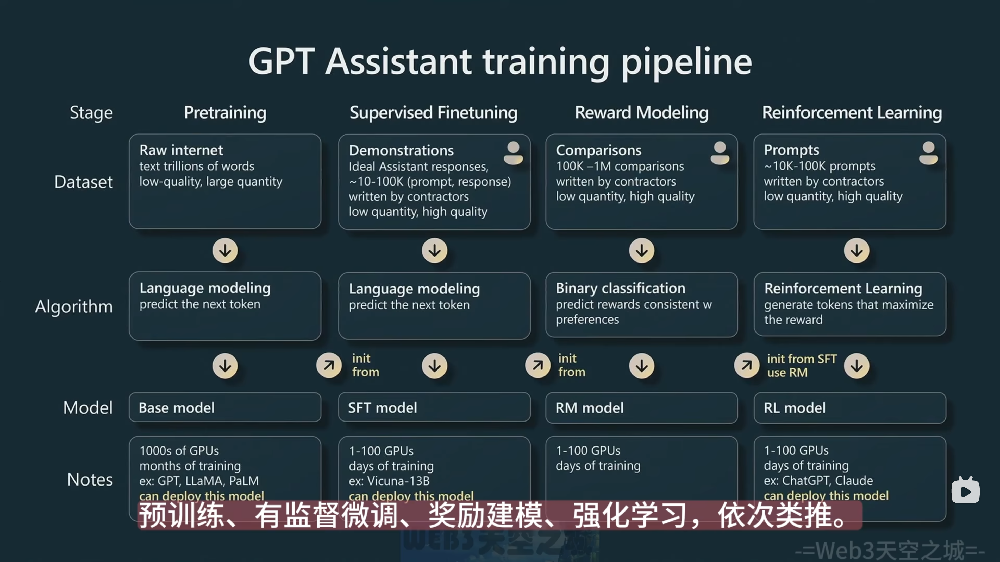
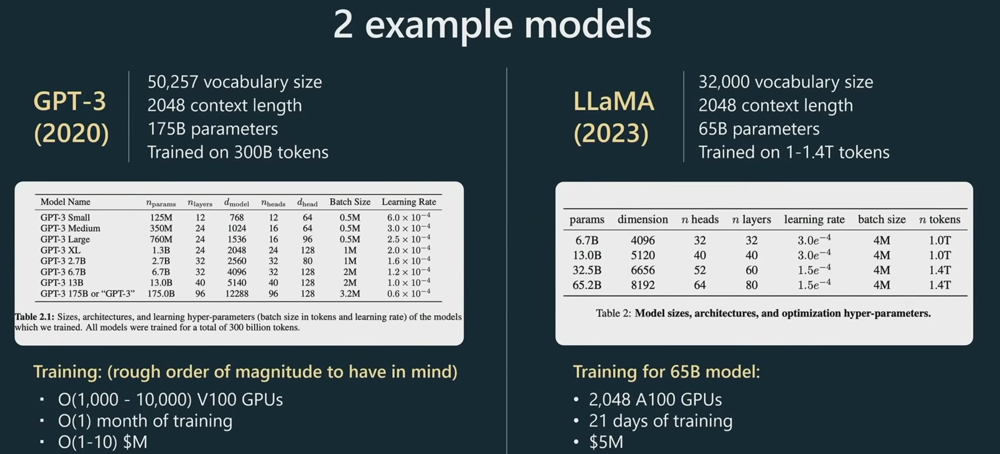
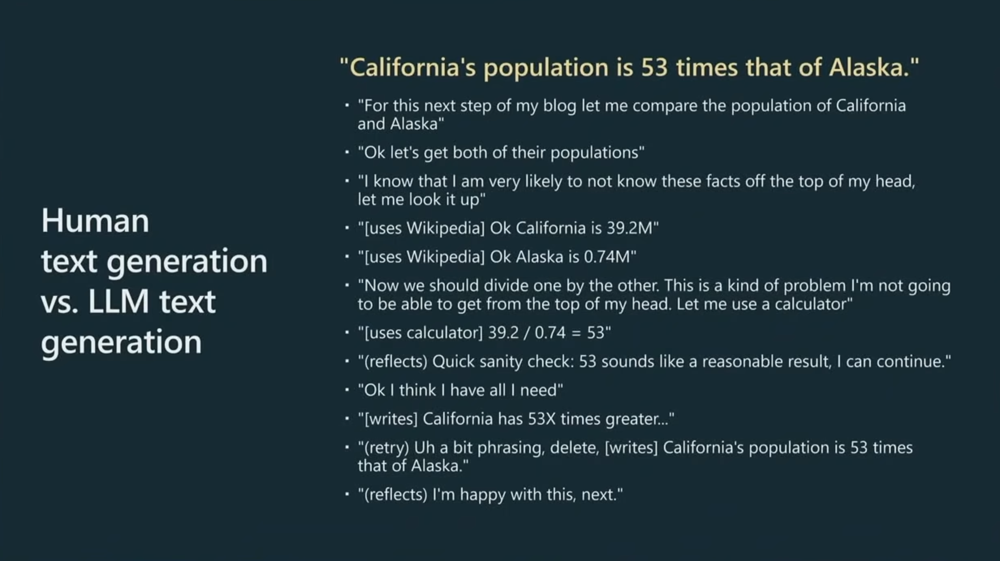
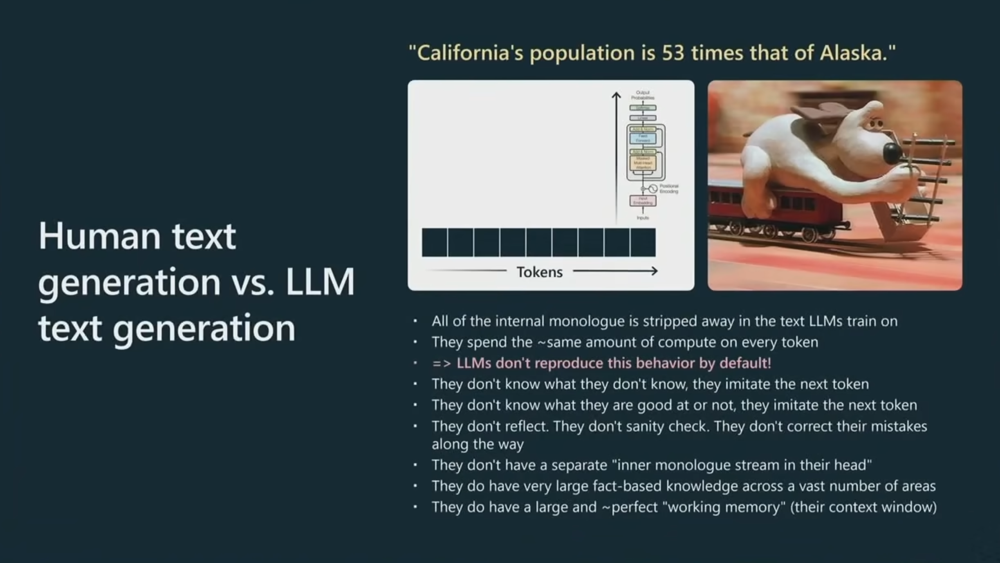
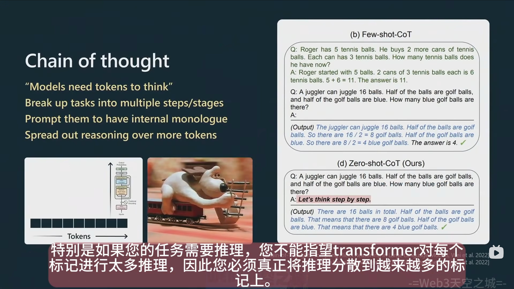
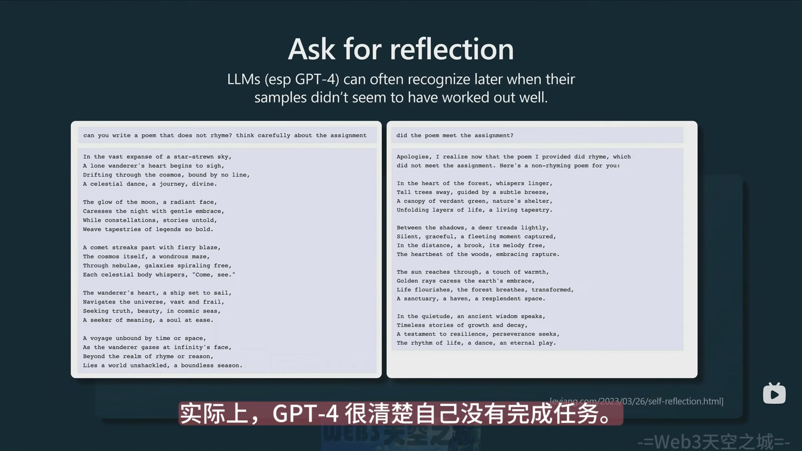
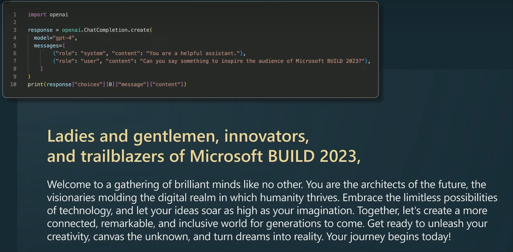

# the state of GPT

## 如何训练GPT

 

- tokenization

  - 10-100k tokens
  - 1 token ～= 0.75 word
  - BPE

- 2 examples

  

- Why RLHF
  - 判断一个结果的好坏，比生成一个结果，更容易
- 模型坍缩（RLHF会使得模型失去一些熵）
  - RLHF模型可能更有自信的生成几个结果
  - 但是base model可以生成更多样化的结果

## 如何将GPT应用于app

- 模型会忽略人类在写作时候的内心对话，不会检查任何东西，不纠正错误。然后每个token会进行相同的计算量，只是一个无情的token 序列模拟器。

- cot

- Self-reflection

- LLM 并不想成功，它只想模拟训练数据集，而在训练数据集中，有各种各样的数据，但是模型无法分辨其质量。如果你想要成功，需要要求模型获得成功。

